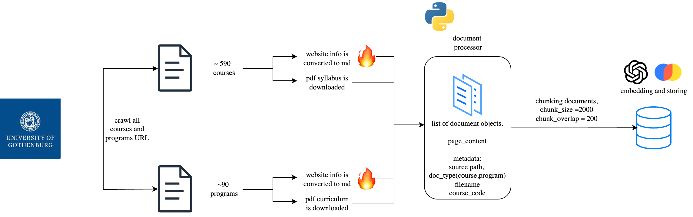
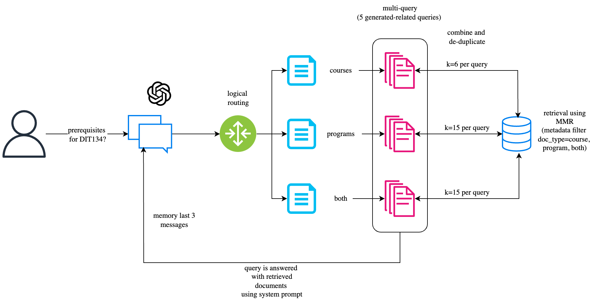

# 🤖 GuPT

[](https://python.org)
[](https://langchain.com)
[](https://openai.com)
[](https://gradio.app)

GuPT is the name of the project developed by a student group for the course **Machine Learning for Natural Language Processing (DIT247)**. The system leverages extracted information from Gothenburg University's (GU) bachelor's and master's courses (~590) and programs (~90), including relevant details from their websites and syllabus PDFs. This data is used as input to **GuPT**, which then employs a **Retrieval-Augmented Generation (RAG)** approach to respond to user queries. 

GuPT's RAG model is built using **[LangChain](https://github.com/hwchase17/langchain)**, **OpenAI** embeddings, and **gpt-5-mini**. By utilizing multi-querying and logic routing, GuPT can handle ambiguous questions and provide both specific and general answers regarding GU courses and programs. The goal is to offer a tool that efficiently provides information on entry requirements, learning objectives, and assessment methods, thereby reducing confusion and administrative workload.

---

## 🚀 Try It Out

[](https://huggingface.co/spaces/NilsDunlop/GuPT)

>  Access our interactive demo and start asking questions about GU courses and programs.
> 
> ### 👉 [**Launch GuPT**](https://huggingface.co/spaces/NilsDunlop/GuPT)

---

## 📋 Table of Contents

1. [Features](#features)
2. [Getting Started](#getting-started)
3. [Installation](#installation)
4. [Usage](#usage)
5. [Data Collection](#data-collection)
6. [Architecture](#architecture)
7. [Evaluation](#evaluation)
8. [Technologies Used](#technologies-used)
9. [Video Presentation](#video-presentation)

---

## ✨ Features

- **Natural Language Querying**: Ask questions about GU courses and programs in plain English.
- **Contextual RAG System**: Retrieves relevant information from a local database of course and program details.
- **Multi-Querying and Logic Routing**: Handles ambiguous queries and routes them through various queries to get precise answers.
- **Scalable**: Built to handle a large volume of course and program data.
- **Efficient Retrieval**: Reduces time spent searching for course or program information manually.

---

## 🚀 Getting Started

These instructions will help you set up a local copy of GuPT for development and testing purposes.

### Prerequisites

- **Python 3.8+**: Ensure you have Python installed.  
- **pip**: Python package manager.  
- **OpenAI API Key**: Required for embedding and text generation. Obtain one from [OpenAI's website](https://platform.openai.com/).

---

## 📁 Project Structure

```
GuPT/
├── 🔧 Core Modules
│   └── src/
│       ├── main.py              # Main entry point
│       ├── config.py            # Configuration and constants
│       ├── models.py            # Pydantic models and data classes
│       ├── rag_service.py       # Core RAG service (LCEL)
│       ├── document_processor.py # Document loading and processing
│       ├── chat_logger.py       # Enhanced chat logging
│       └── interface.py         # Gradio interface
│
├── 📊 Evaluation 
│   └── evaluation/
│       ├── calculators.py       # ROUGE, BERT, semantic similarity
│       ├── eval_models.py       # Data models and types
│       ├── evaluator.py         # Main evaluation orchestrator
│       ├── output.py            # Result reporting and file management
│       ├── settings.py          # Default, fast, comprehensive configs
│       ├── test_loader.py       # Test case loading and filtering
│       └── run_evaluation.py    # Main evaluation runner
│
├── 🗂️ Data
│   ├── data/
│   │   ├── chroma/          # Vector database
│   │   ├── courses/         # Course documents
│   │   ├── programs/        # Program documents
│   │   └── evaluation/      # Evaluation results
│   ├── scraper/             # Web scraping tools
│   └── utils/               # Utility scripts
│
├── ⚙️ Configuration
│   ├── environment.yml      # Python dependencies and environment
│   ├── .env.example         # Environment variables template
│   ├── Makefile             # Build and deployment commands
│   ├── docker-compose.yml   # Docker configuration
│   └── Dockerfile          # Docker image
│
└── 📚 Documentation
    ├── README.md           # This file
    └── chat_history.json   # Chat interaction logs
```

## 📦 Installation

### 🐳 **Option 1: Docker (Recommended)**

```bash
# Clone the Repository
git clone https://github.com/faerazo/GuPT.git
cd GuPT

# Setup environment file
cp .env.example .env
# Edit .env and add your API keys

# Build and run with Docker
make docker-build
make docker-run

# Access at http://localhost:7860
```

### 🐍 **Option 2: Conda Environment**

```bash
# Clone the Repository
git clone https://github.com/faerazo/GuPT.git
cd GuPT

# Use Makefile for easy setup
make setup

# Activate conda environment
conda activate gupt

# Launch the application
python src/main.py
```

### 🔧 **Option 3: Manual Conda Setup**

```bash
# Clone the Repository
git clone https://github.com/faerazo/GuPT.git
cd GuPT

# Create conda environment
conda env create -f environment.yml

# Activate environment
conda activate gupt

# Configure environment variables
cp .env.example .env
# Edit .env and add your API keys

# Launch the application
python src/main.py
```


### 🔑 **Required Environment Variables**

Create a `.env` file in the project root with the following variables:

```env
OPENAI_API_KEY=your_openai_api_key_here
```

### 🚀 **Launch Options**

```bash
# Basic launch
python main.py

# With custom options
python main.py --port 8080 --share
python main.py --rebuild-db --debug
```

### 🌐 **Access the Interface**

Open your browser and navigate to:
- **Local**: http://localhost:7860
- **Network**: http://0.0.0.0:7860 (for network access)

--- 

## 🎯 Usage

### Command Line Options

```bash
python src/main.py [OPTIONS]

Options:
  --share              Enable Gradio public sharing
  --no-share           Explicitly disable sharing (default)
  --port PORT          Port to run on (default: 7860)
  --host HOST          Host to bind to (default: 0.0.0.0)
  --rebuild-db         Force rebuild of vector database
  --debug              Enable debug mode with verbose output
  --quiet              Suppress non-essential output
  --help               Show help message
```

**Note**: Make sure to activate the conda environment before running:
```bash
conda activate gupt
python src/main.py
```

### Example Queries

**Course Information:**
- "What are the prerequisites for Applied Machine Learning DIT867?"
- "How is the Advanced Databases course assessed?"
- "Tell me about the learning outcomes for Computer Security"

**Program Information:**
- "What is the Applied Data Science Master's program about?"
- "List all programs in the School of Business, Economics and Law"
- "What are the admission requirements for the Software Engineering program?"

**General Queries:**
- "What Computer Science courses are available?"
- "Which programs include machine learning courses?"
- "Tell me about courses taught in English"


---

## 🛠️ Makefile Commands

The project includes a Makefile for convenient setup and deployment:

```bash
# View all available commands
make help

# 🐳 Docker Commands (Recommended)
make docker-build   # Build Docker image  
make docker-run     # Run with Docker Compose
make docker-stop    # Stop Docker containers
make docker-clean   # Clean Docker containers and images
make docker-logs    # View application logs

# 📦 Conda Commands (Development)
make install        # Create conda environment
make setup          # Complete setup (environment + .env)
make clean          # Remove conda environment
make test           # Test the installation
make run            # Run the application
```

## 🐳 Docker Deployment

**Note**: Make sure you have created `.env` file with your API keys before running Docker commands.

```bash
# Using Makefile
make docker-build
make docker-run
```

## 📊 Data Collection

Data from the GU courses and programs is crawled from the [GU website](https://www.gu.se/en/study-gothenburg/study-options/find-courses?hits=25) and stored in the `data` folder. The process is summarized in the following diagram:



--- 

## 🏗️ Architecture

The architecture of GuPT is shown in the following diagram:



---

## 📈 Evaluation

The evaluation system has been restructured for better organization and functionality.

### Evaluation Metrics

Run comprehensive evaluation of the RAG system with the new modular structure:

```bash
# Activate conda environment first
conda activate gupt

# Full evaluation (all test types)
python evaluation/run_evaluation.py

# Fast evaluation with smaller subset
python evaluation/run_evaluation.py --subset 50 --config fast

# Comprehensive evaluation with better models
python evaluation/run_evaluation.py --config comprehensive

# Run specific test type only
python evaluation/run_evaluation.py --test-type course_info --subset 20

# Available test types: course_info, prerequisites, learning_outcomes, assessment
# Available configs: default, fast, comprehensive
```

**Output Files:**
- `eval_[timestamp].md` - Human-readable summary
- `evaluation_results_[timestamp].jsonl` - Detailed per-test results
- `aggregated_metrics_[timestamp].json` - Overall metrics

--- 

## 🛠️ Technologies Used
- [Firecrawl](https://www.firecrawl.dev)
- [JSONify](https://github.com/AustonianAI/pdf-to-json)
- [LangChain](https://github.com/hwchase17/langchain)
- [OpenAI](https://openai.com)
- [Chroma](https://docs.trychroma.com/docs/overview/introduction)
- [Gradio](https://gradio.app)

---

## 🎥 Video Presentation

[](https://youtu.be/WVeGGnjLzEs)

